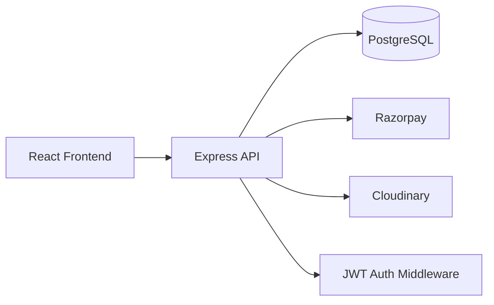
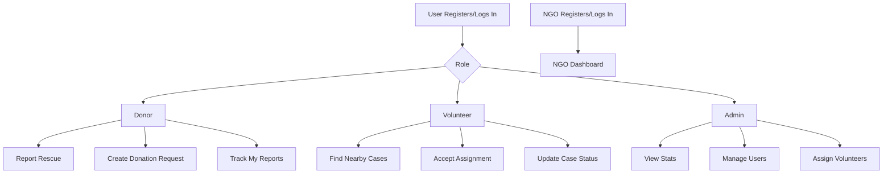
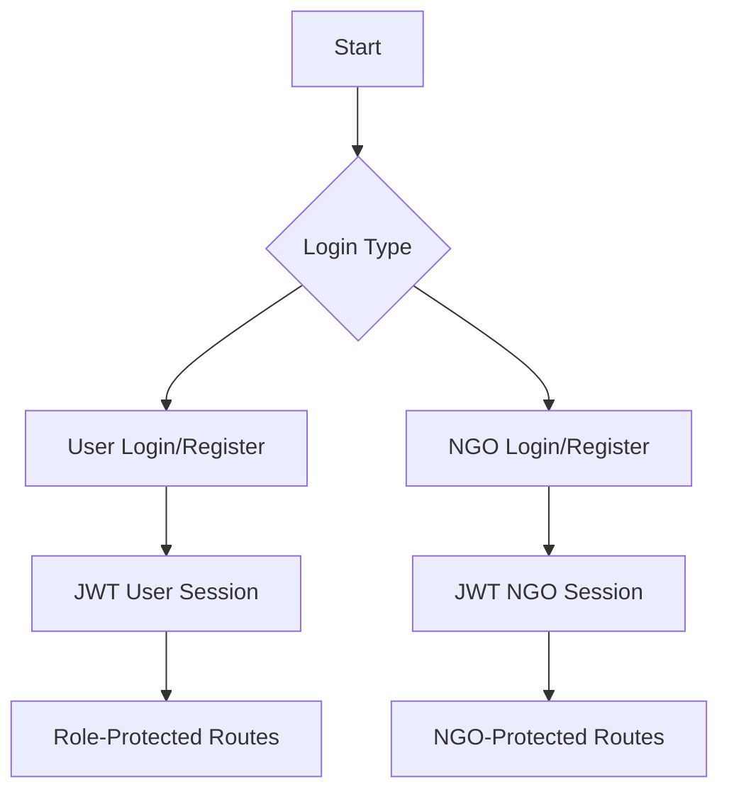
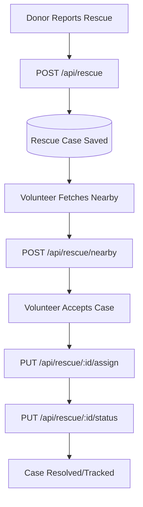
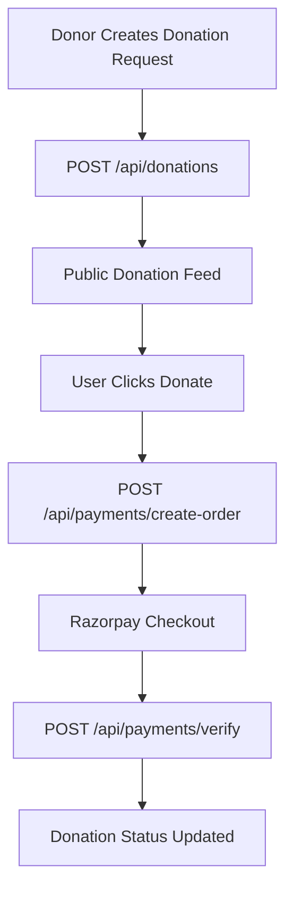
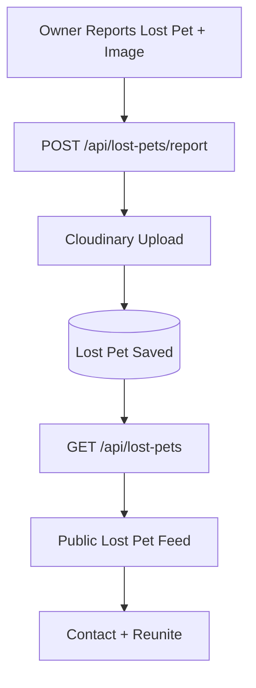

# Animal NGO Platform

A role-based animal rescue platform that connects donors, volunteers, NGOs, admins, and pet owners in one system.

The app helps teams report rescue emergencies, assign nearby volunteers, track rescue outcomes, raise donations, and reunite lost pets.

## What This Project Does

- Donors can report rescue cases and create donation requests.
- Volunteers can discover nearby rescue cases, accept assignments, and update status.
- NGOs have separate registration/login and their own dashboard flow.
- Admins can monitor users, rescue operations, and platform-level stats.
- Pet owners can report lost pets with image + contact info to a public feed.

## Tech Stack

### Frontend (`animal-ngo-frontend`)
- React + Vite
- Tailwind CSS
- Zustand (state management)
- React Router
- Axios
- Leaflet / React-Leaflet

### Backend (`animal-ngo-backend`)
- Node.js + Express
- PostgreSQL (`pg`)
- JWT auth
- Multer + Cloudinary (image uploads)
- Razorpay (payments)

## High-Level Architecture



## User Roles



## Core Product Flows

### 1. Authentication Flow



### 2. Rescue Coordination Flow



### 3. Donation Flow



### 4. Lost Pet Flow



## Repository Structure

```text
animal-ngo-project/
  animal-ngo-frontend/
    src/
      pages/
      components/
      api/
      stores/
  animal-ngo-backend/
    src/
      routes/
      controllers/
      middlewares/
      models/
      config/
      data/
```

## Frontend Route Map (Current App)

### Public
- `/` landing page
- `/login`, `/register`, `/forgot-password`, `/reset-password`
- `/donations`
- `/lost-pets`, `/lost-pets/report`
- `/ngo/register`, `/ngo/login`, `/ngo/:id`

### Protected User
- `/dashboard`
- `/profile`
- `/rescue/report` (donor)
- `/rescue/my-reports` (donor)
- `/donations/new` (donor)
- `/rescue/nearby` (volunteer)
- `/volunteer/cases` (volunteer)
- `/rescue/my-assigned` (volunteer)

### Protected NGO
- `/ngo/dashboard`

### Protected Admin
- `/admin`
- `/admin/users`

## Backend API Modules

Mounted in `animal-ngo-backend/index.js`:

- `/api/users` (auth, profile, password reset, user operations)
- `/api/rescue` (rescue lifecycle + volunteer assignment/status)
- `/api/donations` (donation requests CRUD)
- `/api/payments` (Razorpay order + verify)
- `/api/admin` (admin stats/users/rescue assignment)
- `/api/ngos` (NGO register/login/public profile)
- `/api/lost-pets` (report/fetch/delete lost pets)

## Local Setup

## 1) Clone

```bash
git clone <your-repo-url>
cd animal-ngo-project
```

## 2) Backend Setup

```bash
cd animal-ngo-backend
npm install
```

Create `.env` in `animal-ngo-backend`:

```env
NODE_ENV=development
PORT=5000

DB_USER=...
DB_HOST=localhost
DB_NAME=...
DB_PASSWORD=...
DB_PORT=5434

JWT_SECRET=...

RAZORPAY_KEY_ID=...
RAZORPAY_KEY_SECRET=...

CLOUDINARY_CLOUD_NAME=...
CLOUDINARY_API_KEY=...
CLOUDINARY_API_SECRET=...
```

Start backend:

```bash
npm run dev
```

## 3) Frontend Setup

```bash
cd ../animal-ngo-frontend
npm install
npm run dev
```

Frontend default Vite URL: `http://localhost:5173`  
Backend default URL: `http://localhost:5000`

## Environment Notes

- In development, backend uses local PostgreSQL config (`DB_*` keys).
- In production (`NODE_ENV=production`), backend expects `DATABASE_URL`.
- Backend runs table setup/migrations on startup from `src/data/*`.

## Project Highlights

- Role-based route protection for donor/volunteer/admin.
- Separate NGO auth/session flow.
- Rescue geolocation workflow with nearby case discovery.
- Donation + payment integration.
- Lost pet public feed with image upload.
- Unified frontend design system aligned to landing page.

## Recommended Next Improvements

1. Add automated test suites (frontend + backend).
2. Add API docs (OpenAPI/Swagger) for route contracts.
3. Add CI checks for lint/build/test.
4. Add observability for production (logs, traces, error reporting).
